# Frontity Template

This template provides a convenient way for you to quickly and easily spin up a Frontity project on either [CodeSandbox](https://codesandbox.io) or [StackBlitz](https://stackblitz.com/).

## CodeSandbox

CodeSandbox is a great prototyping tool that you can use to bootstrap a project. You can use this template to create a new Frontity project on CodeSandbox, or if you already have a Frontity project on GitHub you can use that on CodeSandbox too. Instructions for doing both follow.

### Using this template for a new project

- Click on this link: https://githubbox.com/frontity/frontity-template _(use CTRL/CMD + click to open in a new tab)_.
- Wait until the Frontity application starts _(it could take a few seconds)_.
- Click on "Fork" to make your own copy.

  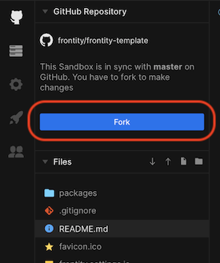

- Make any changes you wish to customise the project.

### Using your own project

- Copy the URL of your GitHub repository.

  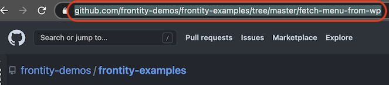

- Rename the domain from `github.com` to `githubbox.com`.

  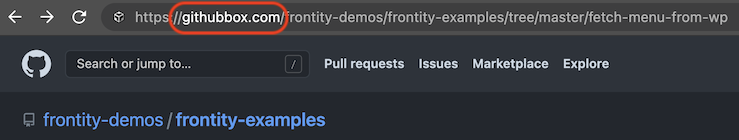

- Enter the new URL in the browser's address bar and press 'Enter'.
- Wait until the Frontity application starts _(it could take a few seconds)_.
- Click on "Fork" to make your own copy _(see above)_.
- Make any changes you wish to further customise the project.

## StackBlitz

StackBlitz is an online IDE where you can create projects with just one click. It automatically takes care of installing dependencies, compiling, bundling, and hot reloading as you type.

You can use this template to create a new Frontity project on StackBlitz, or if you already have a Frontity project on GitHub you can use that on StackBlitz too. Instructions for doing both follow.

### Using this template for a new project

- Click on this link: https://stackblitz.com/fork/frontity _(use CTRL/CMD + click to open in a new tab)_.
- Wait until the command prompt appears.

  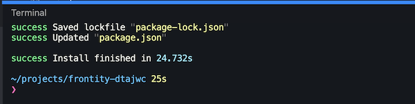

- Run `npm install`.

  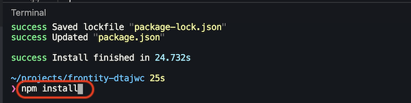

- Run `npx frontity dev` to start Frontity _(it could take a few seconds)_.

  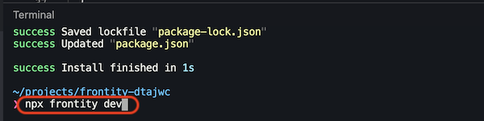

- Make any changes you wish to customise the project.

### Using your own project

- Add the following to your `package.json`:

  ```json
  {
    "workspaces": ["packages/*"]
  }
  ```
  _This is necessary until they add support for `file:/packages...` syntax ([related GH issue](https://github.com/stackblitz/webcontainer-core/issues/107))._

- Commit the change _(and if necessary push to GitHub)_.
- Go to https://stackblitz.com/
- Create a new "Node.js" project.

  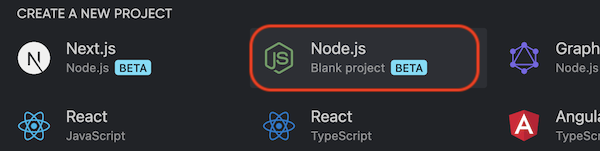

- Click on "Connect repository"

  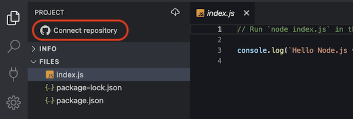

- Click on "Import an existing repository"

  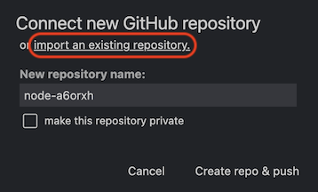

- Enter the URL of your repository. For example: https://github.com/frontity/frontity-template _(you may need to authenticate your GitHub account at this point)_.

  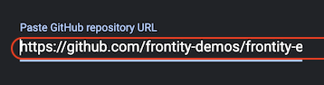

- Once the project is ready delete the `package-lock.json` file _(if it exists)_.

  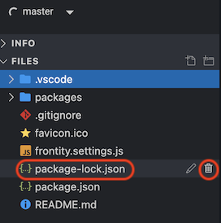

- Run `npm install` in the terminal box

  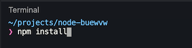

- A new `package-lock.json` file will be created

  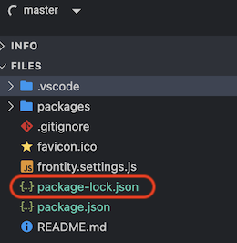

- Start Frontity by running `npx frontity dev` in the terminal box  _(it could take a few seconds)_.

  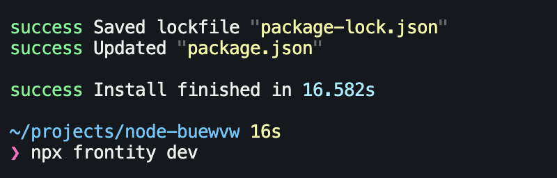

---

## Frontity Community

### Channels

[](https://community.frontity.org/) [](https://twitter.com/frontity) 

Frontity has a number of different channels at your disposal where you can find out more information about the project, join in discussions about it, and also get involved:

- **📖 [Docs](https://docs.frontity.org/):** Frontity's primary documentation resource - this is the place to learn how to build amazing sites with Frontity.

* **👨‍👩‍👧‍👦 [Community forum](https://community.frontity.org/):** join Frontity's forum and ask questions, share your knowledge, give feedback and meet other cool Frontity people. We'd love to know about what you're building with Frontity, so please do swing by the [forum](https://community.frontity.org/) and tell us about your projects.
* **🐞 Contribute:** Frontity uses [GitHub](https://github.com/frontity/frontity) for bugs and pull requests. Check out the [Contributing](https://github.com/frontity/frontity/blob/dev/CONTRIBUTING.md) section to find out how you can help develop Frontity, or improve this documentation.
* **🗣 Social media**: interact with other Frontity users. Reach out to the Frontity team on [Twitter](https://twitter.com/frontity). Mention us in your tweets about Frontity and what you're building by using **`@frontity`**.
* 💌 **Newsletter:** do you want to receive the latest news about Frontity and find out as soon as there's an update to the framework? Subscribe to our [newsletter](https://frontity.org/newsletter).

### Get involved

[](https://github.com/frontity/frontity/issues?q=is%3Aissue+is%3Aopen+label%3A%22good+first+issue%22)

Got questions or feedback about Frontity? We'd love to hear from you in our [community forum](https://community.frontity.org).

Frontity also welcomes contributions. There are many ways to support the project! If you don't know where to start then this guide might help: [How to contribute?](https://docs.frontity.org/contributing/how-to-contribute).

If you would like to start contributing to the code please open a pull request to address one of our [_good first issues_](https://github.com/frontity/frontity/issues?q=is%3Aissue+is%3Aopen+label%3A%22good+first+issue%22).
